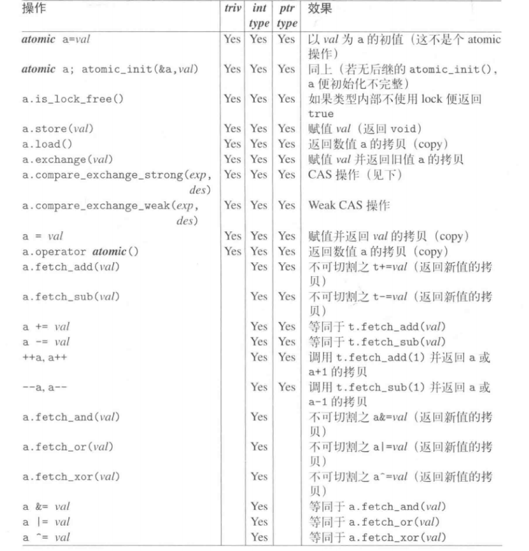
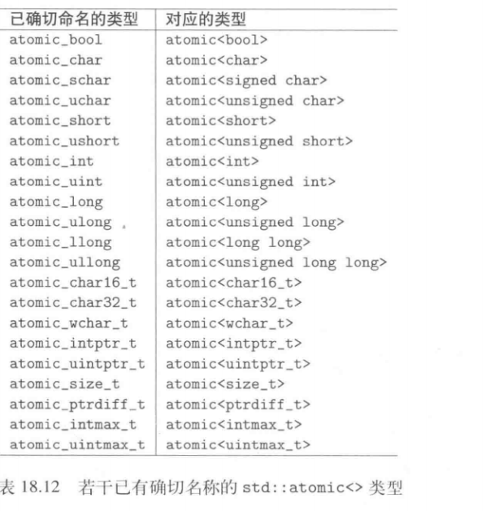
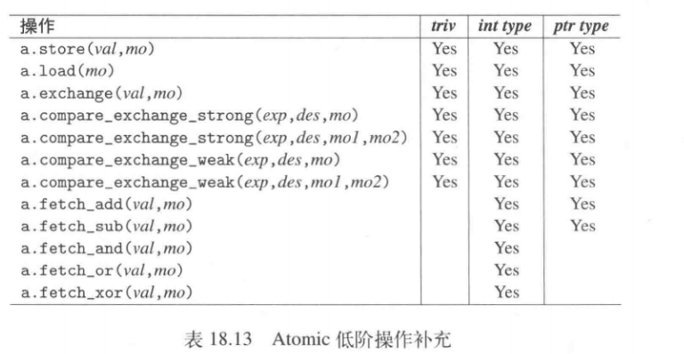

c++编译云慈宁宫情况
+ 一般而言，即使基本类型，读和写也不是不可分割的；
+ 编译器生成的代码有可能改变操作次序。

# atomic

atomic提供的操作将使用默认保证，不论内存访问次序如何，这个more保证提供了顺序一致性---memory_order_seq_cst，即在线程中atomic保证一定“像代码出现的次序”那样发烧。

<!-- ## 高层接口

## 底层接口 -->

```
std::atomic<template>  //一般可以使用一般类型，整数类型或pointer类型作为template参数。

```
两个重要语句：

+ store() 赋予一个新的值。会对影响所及的内存执行一个所谓的release操作确保此前所有内存操作不论是否为atomic，在store发挥效用之前都变成“可被其他线程看见”。
+ load() 取当前值

triv--bool,int type--int,ptr type--pointer


借由is_lock_free()可以检查atomic类型内部是否由于使用lock才成为atomic的

### Atomic的C-style接口

```
std::atomic<boo>
//C-style
std::atomic_bool ab;
std::atomic_init(&ab,false);
std::atomic_store(&ab,true);
if (std::atomic_load(&ab)) {

}
```




### 低层接口


