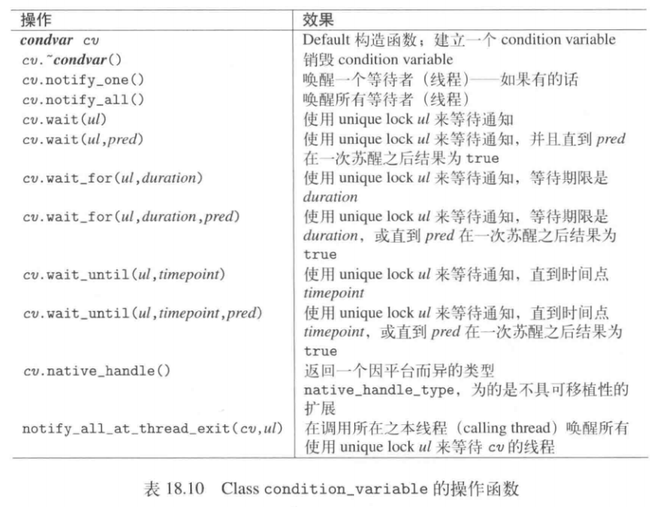

# condition variable

可以用来同步化线程之间的数据流逻辑依赖关系。借由它，一个线程可以唤醒一个或多个其他等待中的线程。由于可能发生假醒的情况，当条件满足时，仅仅通知是不够的，等待者还必须在苏醒之后两次检查该条件。

原则上，condition variable的运行规则如下：

+ 同时包含<mutex>和<condition_variable>，并声明一个mutex和一个condition variable
+ 那个激发“条件终于满足”的线程（或多线程之一）必须调用 (可能会有假醒的情况)
```
readyCondVar(变量).notify_one(); //
```
或
```
readCondVar(变量).notify_all(); //
```

若无法构建condition variable，构造函数会抛出std::system_error异常并夹带差错码resource_unavailable_try_again

<condition_variable>头文件下提供了两个对应的class：

+ condition_variable
+ condition_variable_any



### condition_variable

所有通知都会被同步化；

所有等待某个condition variable的线程必须使用相同的mutex,当wait家族的某个成员被调用时mutex必须被unique_lock锁定，否则会发生不明确的行为。

condition variable的消费者总是在“被锁住的mutex”基础上操作，只有等待函数会执行以下三个atomic步骤暂时解除：

1. unlocking mutex 然后进入waiting state;
2. 解除因等待而造成的阻塞；
3. 再次锁住mutex

wait_for和wait_until不接受判断式的版本，返回以下枚举类：

+ std::cv_status::timeout -- 发生不容置疑的超时
+ std::cv_status::no_timeout--如果发生通知

接收判断式作为第三参数的版本，会返回判断式的执行结果。

全局函数notify_all_at_thread_exit(cv,l)用来在其调用者退场时调用notify_all。锁住对应的lock，等待线程共享同一个mutex

### condition_variable_any

？
