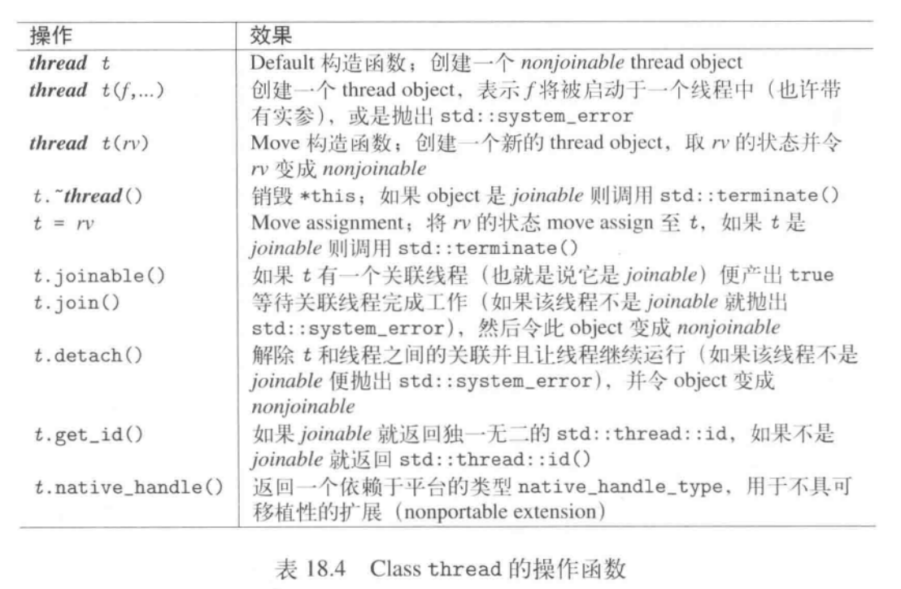

# async

形式：

  ```
  future async ([std::launch::async/deferred,]F func,args)
  //F为成员函数，需要传入object的指针或引用
  ```


# future

用来表现某一个操作的成果，可能是一个值或一个异常，但不可能两者都是，这个成果被管理于一个shared state内。

shared state可由 async,packaged_task,promise创建出来。

wait() 和get()会同步启动task,但wait_for(),wait_until都不会令一个被推迟任务启动。

future不提供copy构造函数，也不提供copy assignment操作，确保两个object绝不共享某一后台操作状态，至于move 或move assignment操作


# shared future

# thread

join()：将等待线程成果
detach():将明确失去对线程的关联。

需要在obj生命周期结束前或被新的obj move assigned之前调用，否则会因程序std::terminate而中止。

提供了一个static成员函数，用来查询并行线程的可能数量（只是一个参考），不明确或不可计算，返回0 ：
```
unsigned int std::thread::hardware_concurrency()
```



# promise

只能调用get_future()一次，第二次调用会抛出std::future_error并带着差错码std::future_errc::future_already_retrieved。如果没有相应的shared state会抛出future_error异常并带有差错码std::future_errc::no_state


# packaged_task

被用来同时持有目标函数和成果。

可以通过目标函数初始化task---然后task实施调用目标函数--最后拿一个future以便处理成果。


# this_thread

|操作|效果|
|:--|:--|
|this_thread::get_id()   |当前线程ID   |
|this_thread::sleep_for(dur)   |将某个线程阻塞dur时间段   |
|this_thread::sleep_until(tp)   |将某个线程阻塞直到时间点tp   |
|this_thread::yield()   |建议释放控制以便重新调度（reschedule），让下一个线程能够执行  |
