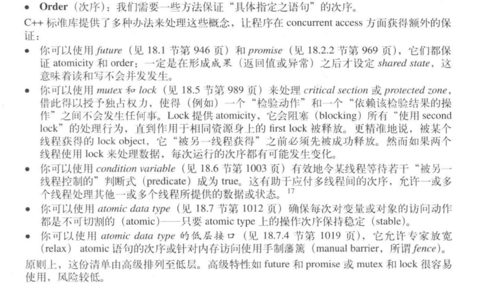
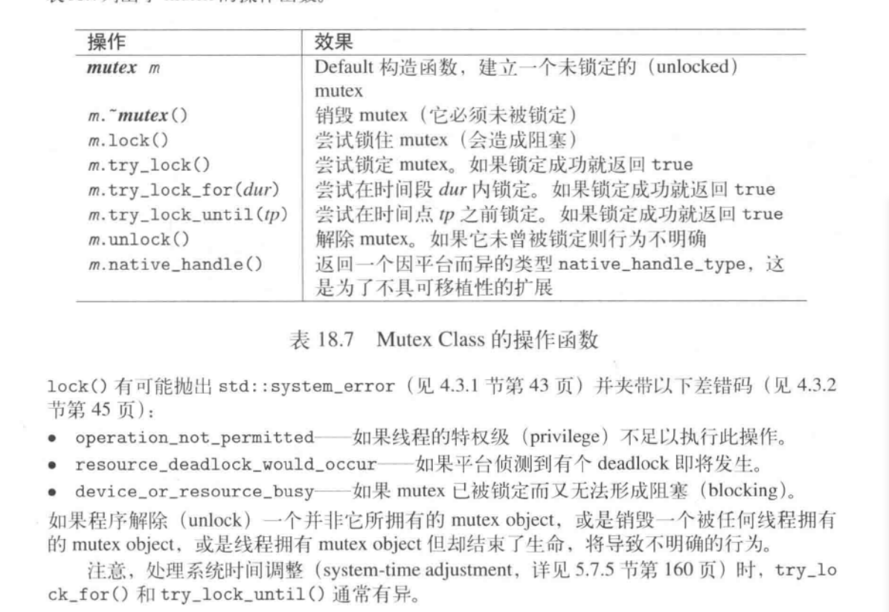
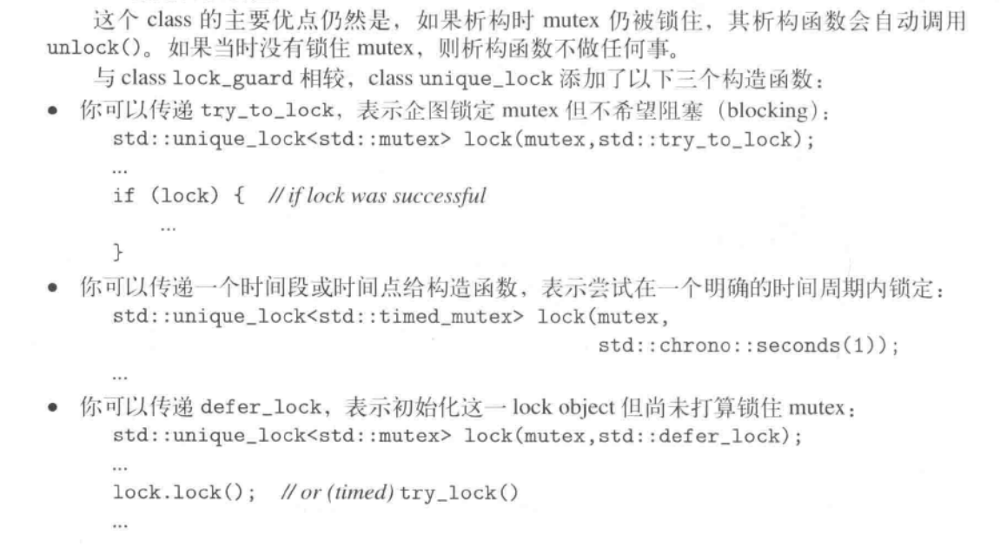
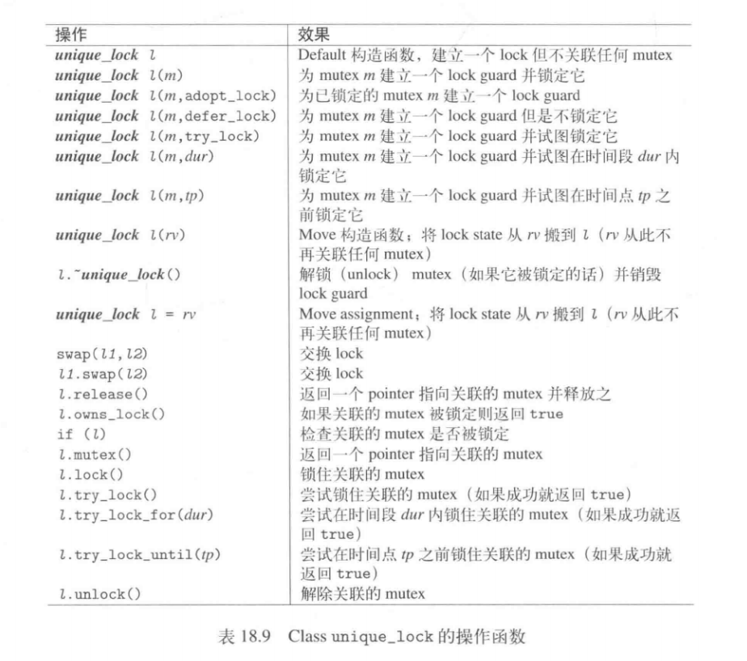

# 线程同步和并发的问题

## 同步化技术

+ Mutex和lock,call_once()
+ condition variable
+ atomic

**多个线程并发处理相同的数据而又不曾同步化(synchronization),那么唯一安全的情况就是，所有线程只读取数据** bit field

+ Unsynchronized data access
+ half-written
+ recordered statement (编译器可能会重新安排执行顺序。c++编译器有能力生成高度优化代码，而某些优化可能需要重新排列语句。)

**除非另有说明，C++标准库提供的函数通常不支持“写或读”动作与另一个"写"（写至同一数据）动作并发执行**

## 三个概念

+ Atomicity(不可切割性)：独占的，无任何打断的
+ Order(次序)

+ volatile(c++关键字，用来阻止过度优化)和concurrency

# Mutex和Lock

+ mutex 同一时间只可能被一个线程锁住，任何其他lock()都会阻塞，知道这个mutex再次可用且try_lock()会失败
+ recursive_time_mutex 允许同一线程多次被同一线程获得其lock
+ timed_mutex 额外运行一个时间段或时间点，用来定义多长时间内可以捕捉一个lock
+ recursive_time_mutex 允许同一线程多长取得其lock,可指定期限
<table>
 <tr>
  <td>操作</td>
  <td>mutex</td>
  <td>recursive_time_mutex</td>
  <td>timed_mutex</td>
  <td>recursive_timed_mutex</td>
 </tr>
 <tr>
   <td>lock()</td>
   <td colspan='4'>捕获mutex(若无捕获则阻塞) </td>
 </tr>
 <tr>
   <td>try_lock()</td>
   <td colspan='4'>捕获mutex(若无捕获返回false) </td>
 </tr>
 <tr>
   <td>unlock()</td>
   <td colspan='4'>解除被锁定的mutex </td>
 </tr>
 <tr>
   <td>try_lock_for()</td>
   <td>-</td>
   <td>-</td>
   <td colspan='2'>试着在时间段内捕获一个lock </td>
 </tr>
 <tr>
   <td>和try_lock_until()</td>
   <td>-</td>
   <td>-</td>
   <td colspan='2'>试着捕获一个lock直到某个时间点</td>
 </tr>
 <tr>
   <td>unlock()</td>
   <td>否</td>
   <td>是，同一线程</td>
   <td>否</td>
   <td>是，同一线程</td>
 </tr>
</table>

<!--
|操作|mutex|recursive_time_mutex|timed_mutex|recursive_timed_mutex|
|:--|:--|:--|:--|:--| -->

## lock_guard<>

std::lock_guard<std::mutex> lg(valMutex); //lock and automatically unlock,为mutex建立一个lock guard并锁定
std::lock_guard<std::mutex> lg(valMutex,std::adopt_lock),为已经锁定的mutex建立一个lock guard

lock_guard:在当下作用域的任何窗口都会自动释放unlock mutex（*是否需要加入第二实参adopt_lock*）

一个函数调用另外一个有锁的函数，出现同一个mutex的重复锁，会造成死锁的状况。这种情况，c++标准允许第二次lock抛出异常std::system_error并带差错码resource_deadlock_would_occur.

借助使用recursive_mutex,上述情况可以得到解决。这个mutex允许同一线程多次锁定，并在最近一次相应的unlock()时释放lock

mutex的成员函数try_lock(),试图获取一个lock，成功--true,失败--false,try_lock即使未被别人拿走也有可能会失败，为了等待特定长度的时间，可以使用带时间性的mutex

+ timed_mutex
+ recursive_timed_mutex

额外允许调用，try_lock_for()和try_lock_until

### 多个lock

std::lock()会锁住它收到的所有mutex，而且阻塞知道所有mutex都被锁定或知道抛出异常，如果时抛出异常，已成功锁定的mutex都会被解锁。

lock()提供了一个deadlock回避机制

try_lock(m1,m2)会在取得所有锁的情况下返回-1，否则返回第一个失败的lock索引（这样的话，所有成功的lock会被unlock）

tyr_lock()不提供deadlock的回避机制，但他保证以实参序列进行锁定

## unique_lock<>

为一个不一定锁定（或拥有）的mutex提供一个lock guard

接口和lock_guard<>相同，但又明确的提出了'何时'以及'如何'锁定或解锁mutex

可以调用owns_lock()和bool()来查询mutex目前是否被锁住

提供了release()来释放mutex或是将mutex拥有权转移给另一个lock

## 多线程下只调用一次
mutex提供了一个特殊解法：
1. std::once_flag
2. std::call_once,第一个实参是相应的once_flag,下一个实参是可调用的对象，如函数（成员函数），function object或lambda

std::once_flag oc;
std::call_once(oc,[]{}); //std::call_once(oc,func)
